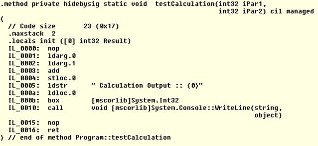

## What is C#?

C# (pronounced "See Sharp") is a programming language that was created as a child of C, and an evolution of C++. It is object-oriented and type-safe, which may be familiar for Java developers as well. C# enables developers to build secure and robust applications with .NET. Check [Microsoft's Documentation on the C# language](https://docs.microsoft.com/en-us/dotnet/csharp/).

As C# is object-oriented language, all types inherit from the `object` type, including primitive types such as `int` and `bool`. Values of any type can be stored, operated, and transported upon in a consistant manner inherited from the `object` type. C# also supports user-defined [value](https://docs.microsoft.com/en-us/dotnet/csharp/language-reference/builtin-types/value-types) and [reference](https://docs.microsoft.com/en-us/dotnet/csharp/language-reference/builtin-types/reference-types) types, and generic methods and types, which provides increased type safety and performance.

C# provides several features that help create robust and durable applications. Iterators enable implementers of collection classes to define custom behaviors for client code. Nullable types assist in having control over variables that don't refer to allocated objects, preventing issues. Exception handling provides a structured and extensible approach to error detection and recovery. Garbage Collection recovers memory from unused unreachable objects. Asynchronous Operations support contributes to building distributed systems. Functional programming is supported by Lambda Expressions. Language Integrated Query (LINQ) enables working with data from any source in a standard pattern.

The .NET SDK compiles several languages to Microsoft Intermediate Language (MSIL) (also known as Compiled Intermediate Language - CIL). It provides a compiler for each C#, F#, and VB.NET language that takes the source files and translates them into MSIL. This enables the C# language to evolve and grow with flexibility independent of the runtime environment. We can use tools, such as IL Diassembler (ILDASM), to see what the intermediate language is, from a compiled .NET executable or library.

*MSIL/CIL Code example*