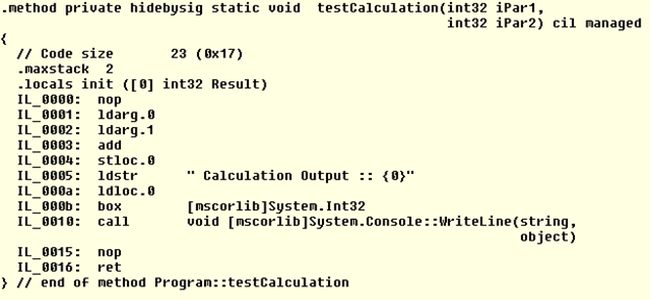

## C# compiles to MSIL

C# is one of several .NET languages that compile to Microsoft Intermediate Language (MSIL). Each .NET language has its own compiler that compiles source files (in their particular programming language) to MSIL.

.NET languages:

- F#
- C#
- Visual Basic

Because of this, the C# language can evolve and grow independent of the runtime environment. For example, there are many C# versions (4 - 7.3) that are able to compile to MSIL that can run in .NET Runtime 4. C# versions usually release together with new versions of the compiler.

We can use tools, such as IL Diassembler (ILDASM), to see what the intermediate language is, from a compiled .NET executable or library.

*MSIL/CIL Code example*

## .NET Runtime is responsible for running MSIL

Once C# files are compiled to MSIL, they need to be executed. The .NET Runtime is responsible for executing that intermediate language (.NET executables).

The runtime can be installed on a server or workstation, separate from the Software Development Kit(SDK). So you don´t need to have the developer setup to execute MSIL in the platform you want to run your application.

Newer versions of the .NET Runtime, starting with .NET Core, are cross-platform. So they can run on Windows, Linux or MacOS. That means with C#, you can build applications that target a variety of platforms.

Another feature from newer versions is that the runtime can be deployed bundled with the application, eliminating the need for a separate instalation. This is useful for running many applications with different runtimes, in the same platform. It simplifies the deployment and management of the dependencies.

